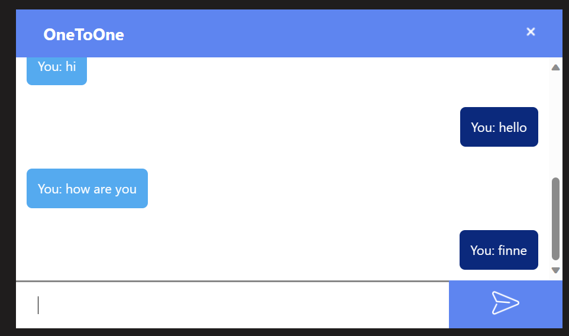

# One-to-One Chat Application (MERN Stack with Socket.IO)

This project is a one-to-one chat application built using the MERN (MongoDB, Express.js, React.js, Node.js) stack with real-time functionality powered by Socket.IO.



## Features

- Real-time one-to-one messaging using Socket.IO.
- User authentication and authorization.
- MongoDB database for storing user information and chat messages.
- Responsive and intuitive UI for seamless communication.

## Technologies Used

- **Frontend:**

  - React.js
  - Redux (for state management)
  - Socket.IO Client

- **Backend:**
  - Node.js with Express.js
  - Socket.IO
  - MongoDB with Mongoose (for database)

## Installation

1. Clone the repository:
   ```bash
   git clone https://github.com/yourusername/one-to-one-chat-app.git
   cd one-to-one-chat-app
   ```
